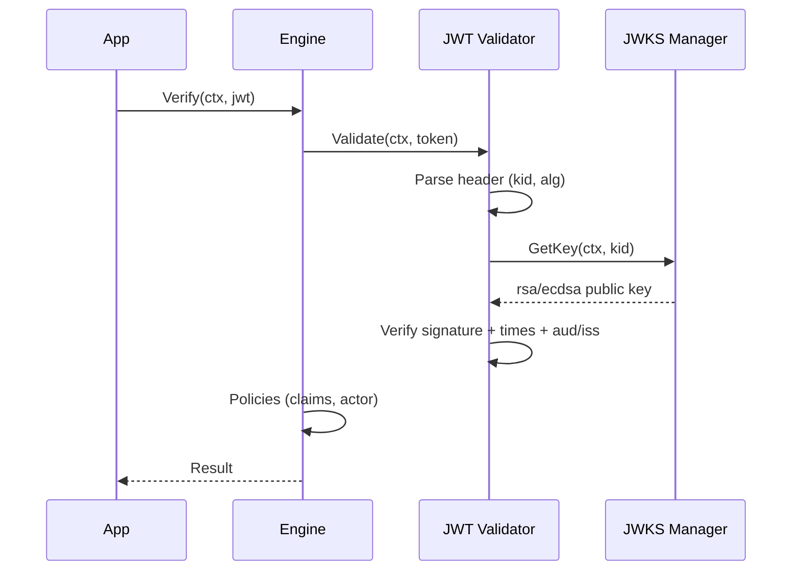
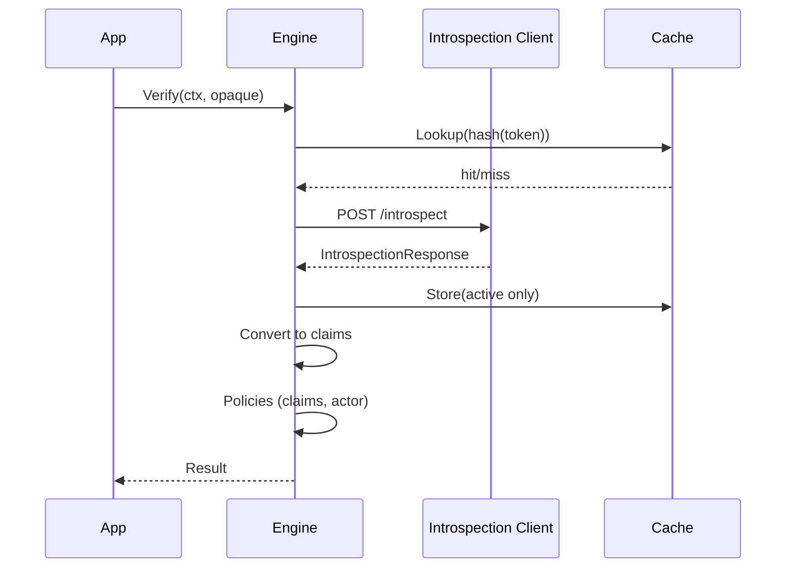
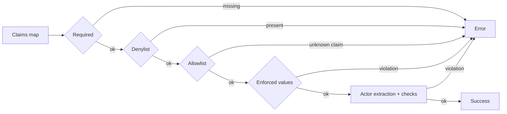

# Architecture

This document outlines how goAuthly verifies tokens and where pluggable components fit. All flows below are library-only — no adapters or servers are included.

## High-level Flow (Mermaid)

```mermaid
flowchart TD
    A[Engine.Verify(token)] --> B{Detect type}
    B -->|JWT| C[verifyJWT]
    B -->|Opaque| D[verifyOpaque]
    C --> E[JWT Validator]
    E --> F[Get key by kid from JWK Manager]
    F --> G[Verify signature + claims]
    G --> H[Policies: claims + actor]
    D --> I[Introspection client]
    I --> J[Cache by token hash]
    J --> K[Parse response -> claims]
    K --> H
    H --> L[Result]
```

## JWT Flow (Mermaid)



## Opaque Flow (Mermaid)



## Policy Validation Flow (Mermaid)



## Components

- Engine: orchestrates verification, caches, and policies.
- JWT Validator: parses and validates JWTs; gets keys via JWK Manager.
- JWK Manager: fetches and caches JWKS; supports stale reads when enabled.
- Introspection Client: calls RFC 7662 endpoint and maps extras.
- Cache: minimal TTL cache abstraction used for JWKS and introspection.
