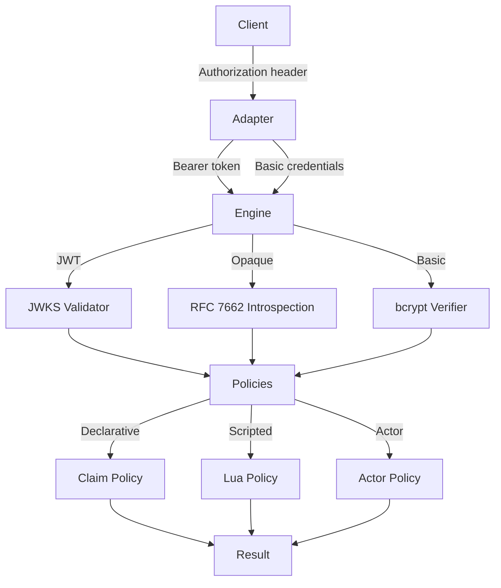
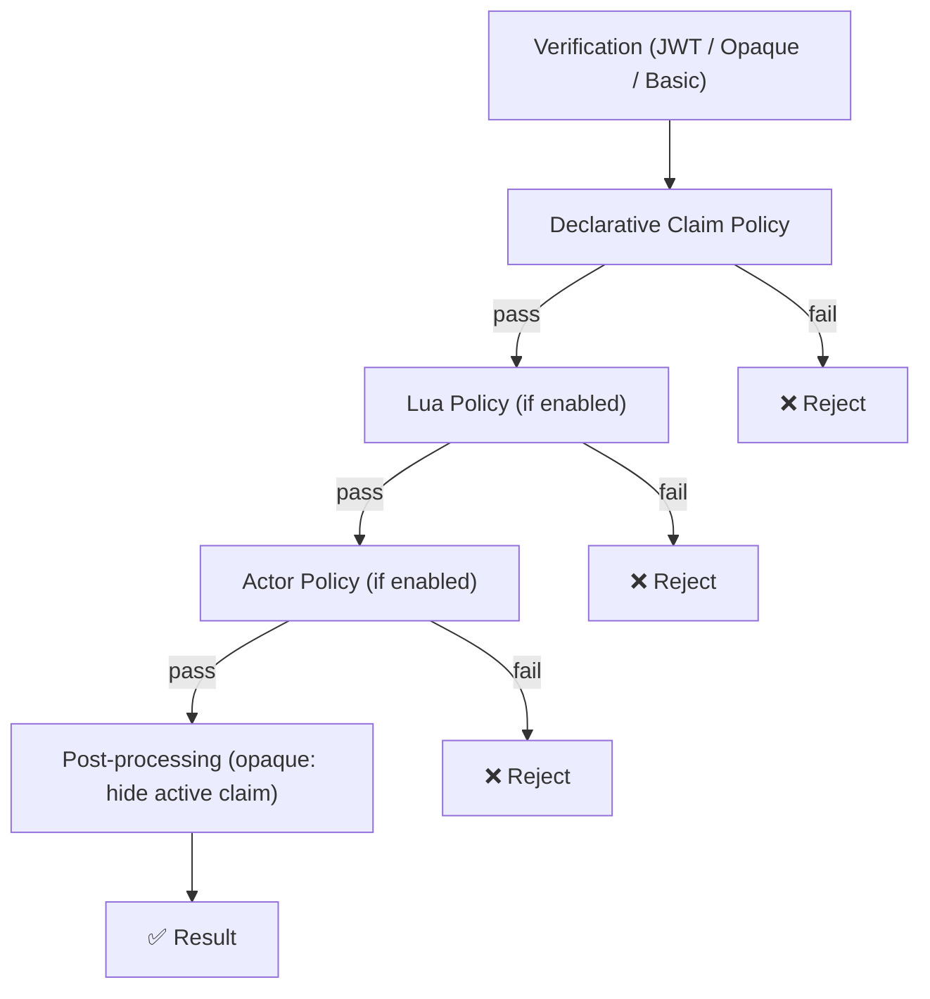
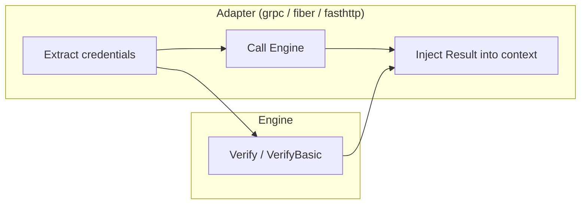

# Architecture

goAuthly follows a simple, layered design: **Adapters → Engine → Verifiers → Policies → Result**.

There are no plugin registries, no abstract factory chains, no middleware-of-middleware. Just a clean pipeline that takes credentials in and hands a decision out.

---

## Full Flow



## Policy Evaluation Order

Policies are evaluated in a strict, deterministic order. If any step rejects, the pipeline stops and returns an error.



**Order:**
1. **Token verification** — JWT signature/claims, introspection active check, or bcrypt comparison.
2. **Declarative claim policy** — required, denied, allowlisted, enforced values.
3. **Lua policy** — conditional scripted checks, runs after declarative.
4. **Actor policy** — extract and validate RFC 8693 actor claims.
5. **Post-processing** — opaque-specific cleanup (hide `active` claim unless configured).

## Adapter Integration Model

Adapters are intentionally thin. They do three things:

1. **Extract** the Authorization header (Bearer or Basic).
2. **Call** `Engine.Verify()` or `Engine.VerifyBasic()`.
3. **Inject** the `Result` into the framework's context mechanism.



No business logic lives in adapters. They don't validate claims, check policies, or cache anything. That's the Engine's job.

## Package Layout

```
authly/              Public API: Config, Engine, Result, Policies
├── config.go        Configuration types and validation
├── engine.go        Engine: Verify, VerifyBasic, caching, policy pipeline
├── basic.go         BasicAuthConfig and VerifyBasic method
├── policy.go        ClaimPolicy, ActorPolicy
├── errors.go        Sentinel errors
└── options.go       Functional options (WithHTTPClient, WithCache, etc.)

internal/
├── basic/           bcrypt-based Basic Auth verifier
├── cache/           Ristretto cache wrapper
├── core/            Shared verifier interface
├── jwk/             JWKS manager with HTTP fetching and caching
├── luaengine/       Lua policy compiler and evaluator
└── oauth/
    ├── introspect/  RFC 7662 introspection client
    └── jwt/         JWT validator with JWKS key provider

adapters/
├── grpc/            Unary + stream interceptors
├── fiber/           Fiber middleware
└── fasthttp/        fasthttp middleware wrapper

tests/               All tests (engine, policies, adapters, no-panic)
docs/                Documentation
```

## Design Principles

- **No panics.** Every error path returns an error. Type assertions use the comma-ok pattern.
- **No background goroutines.** JWKS refresh and cache eviction happen on the request path. You can add your own refresh loop if needed.
- **Immutable after construction.** Config and Engine are safe for concurrent reads. No shared mutable state.
- **Thin adapters.** Framework-specific code is minimal. All logic lives in the Engine.
- **Constant-time security.** bcrypt comparison for passwords, SHA-256 hashing for cache keys.
