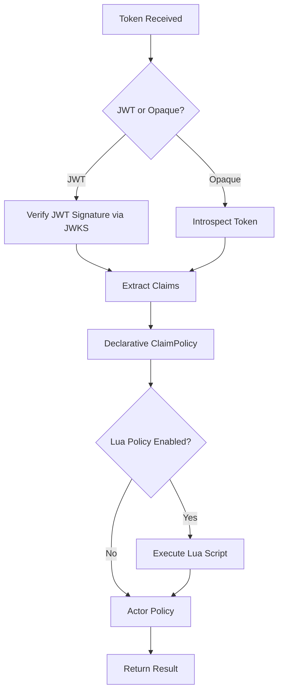
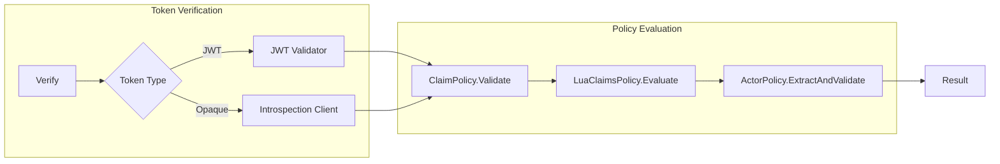

# Claims Policy Guide

goAuthly provides two layers of claim validation: declarative policies and Lua scripts.

## Policy Evaluation Order



## Verification Path



## Declarative Claim Policy

Configure claims validation using `ClaimPolicy`:

```go
policy := authly.ClaimPolicy{
    // Claims that MUST be present
    Required: []string{"sub", "iss"},

    // Claims that MUST NOT be present
    Denylist: []string{"password", "secret"},

    // If set, ONLY these claims are allowed (all others rejected)
    Allowlist: []string{"sub", "iss", "aud", "exp", "scope"},

    // Claims must have specific values (if present)
    EnforcedValues: map[string][]any{
        "iss": {"https://issuer.demo"},
        "scope": {"read", "write"},
    },
}
```

### Type-Specific Policies

Apply different rules for JWT and opaque tokens:

```go
policies := authly.Policies{
    JWTClaims: authly.ClaimPolicy{
        Required: []string{"sub", "iss"},
    },
    OpaqueClaims: authly.ClaimPolicy{
        Required: []string{"sub", "scope"},
    },
}
```

## Lua Claim Rules

For complex conditional logic, use Lua scripts. Lua runs **after** declarative policies.

### Enable Lua Policy

```go
cfg := authly.Config{
    // ...
    Policies: authly.Policies{
        Lua: authly.LuaClaimsPolicy{
            Enabled: true,
            Script: `
                -- Your policy logic here
            `,
        },
    },
}
```

### Available Functions

| Function | Description |
|----------|-------------|
| `has(key)` | Returns `true` if claim exists |
| `get(key)` | Returns claim value (or `nil`) |
| `require_claim(key)` | Fails if claim is missing |
| `require_value(key, value)` | Fails if claim != expected value |
| `require_one_of(key, {values})` | Fails if claim not in set |
| `reject(msg)` | Always fails with message |
| `is_string(key)` | Returns `true` if claim is a string |
| `is_number(key)` | Returns `true` if claim is a number |
| `is_bool(key)` | Returns `true` if claim is a boolean |
| `is_table(key)` | Returns `true` if claim is a table/array |

### Available Variables

| Variable | Description |
|----------|-------------|
| `claims` | Lua table of all token claims |
| `token_type` | `"jwt"` or `"opaque"` |

### Examples

#### Conditional claim requirements
```lua
-- If actor claim exists, require sub and validate issuer
if has("actor") then
    require_claim("sub")
    require_value("iss", "https://issuer.demo")
end
```

#### Cross-claim dependency
```lua
-- If claim "xy" exists, then "x" must exist and be one of a,b,c
if has("xy") then
    require_claim("x")
    require_one_of("x", {"a", "b", "c"})
end
```

#### Token-type aware rules
```lua
-- Require scope only for opaque tokens
if token_type == "opaque" then
    require_claim("scope")
end

-- Require email_verified only for JWT
if token_type == "jwt" then
    if has("email") then
        require_value("email_verified", true)
    end
end
```

#### Type checking
```lua
if not is_string("sub") then
    reject("sub must be a string")
end
if has("age") and not is_number("age") then
    reject("age must be a number")
end
```

#### Custom validation with get()
```lua
if has("role") then
    local r = get("role")
    if r ~= "admin" and r ~= "service" then
        reject("invalid role: must be admin or service")
    end
end
```

### Lua Config File Example

When using Lua config files, the script is embedded inline:

```lua
return {
  mode = "oauth2",
  oauth2 = { ... },
  policies = {
    claims = {
      required = {"sub"},
      denylist = {"password"},
    },
    lua = {
      enabled = true,
      script = [[
        if has("actor") then
          require_claim("sub")
          require_value("iss", "https://issuer.demo")
        end
        if has("xy") then
          require_claim("x")
          require_one_of("x", {"a","b","c"})
        end
      ]]
    }
  }
}
```

### Safety & Performance

- **Compile once**: Lua scripts are compiled once when the Engine is created and reused for all `Verify()` calls.
- **Sandboxed**: No `os`, `io`, `debug`, `dofile`, `loadfile`, or `load` functions available.
- **Timeout**: Execution is protected by a context-based timeout (default 5 seconds).
- **No panics**: All Lua VM errors are caught and returned as Go errors.
- **Config reload**: If the script changes, create a new Engine.
